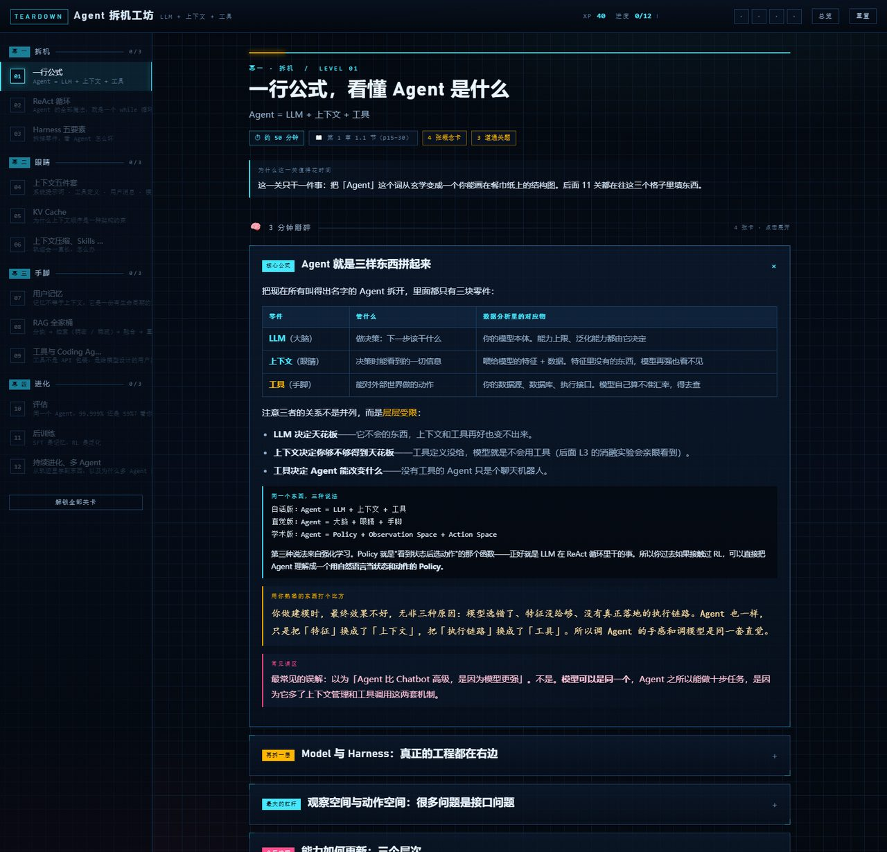
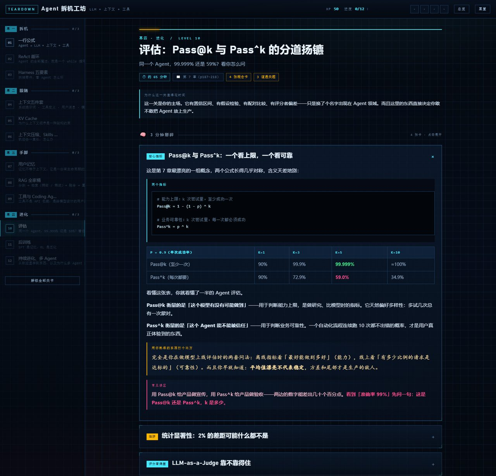

<div align="center">

# 🔧 Agent 拆机工坊

**不读这本书，把它拆开看。**

把《深入理解 AI Agent》306 页的内容，拆成 **12 个关卡 · 44 张概念卡 · 12 个能拧的模拟器 · 36 道即时判分题 · 6 个离线实验**。

全部离线运行 · 不需要联网 · 不需要 API key · 不需要安装任何东西

</div>

---

## 这是什么

[《深入理解 AI Agent：设计原理与工程实践》](https://github.com/bojieli/ai-agent-book)（李博杰）是一本很好的书，但它是 306 页、10 章、108 个实验。

对没耐心逐页读、又想真学会的人来说，它真正的信息量其实收敛得很快——**全书基本是在展开一行公式**：

```
Agent = LLM + 上下文 + 工具
```

所以我们把这行公式**拆开**，做成了可以上手玩的东西：

- **不想读书** → 每关先给你 3 分钟读完的概念卡，再用一个模拟器让你**亲手把 Agent 弄坏**，最后 3 道题确认你真懂了
- **想动手** → 6 个离线 Python 实验，每个都跑出真数字，末尾用 `assert` 自检；结论对不上会当场报错
- **数据分析背景** → 整套东西都在用你熟悉的语言解释（缓存命中率、粗排+精排、置信区间、Goodhart's law……）

## 效果预览

<div align="center">






</div>

## 快速开始

### Windows：双击就行

```
双击  开始学习.cmd
```

然后按数字键，不敲任何命令：

```
[1] 打开闯关应用（主教材）     [3]-[8] 跑 lab1-lab6
[2] 打开学习方案（总纲）       [9] 全部跑一遍      [0] 退出
```

启动器会自动找到你机器上的 Python 并检查 numpy；找不到会告诉你怎么办。**如果不想装 Python，只按 `1` 也完全够玩**（闯关应用是纯网页）。

### 其他系统 / 手动方式

**闯关应用**：直接用浏览器打开 `agent-teardown/index.html`，就这么简单（没有构建、没有服务器、没有 npm）。

**Python 实验**：

```bash
cd labs
python lab1_react.py      # Python >= 3.10，只需要 numpy
```

> 中文乱码的话，先 `chcp 65001`（Windows）或 `export PYTHONIOENCODING=utf-8`。

## 四幕十二关

| 幕 | 关 | 讲什么 | 能拧的模拟器 |
| --- | --- | --- | --- |
| **一 · 拆机** | 01 | `Agent = LLM + 上下文 + 工具` 的三个视角 | 零件拆解台 |
| | 02 | ReAct 循环：想 → 做 → 看 | **ReAct 轨迹机**：勾掉「工具定义/思考过程/历史」，看 Agent 当场变傻 |
| | 03 | Harness 五要素 + 一场消融实验 | 复现书中实验 1-1 的五行对照 |
| **二 · 眼睛** | 04 | 上下文五件套：Agent 到底看到了什么 | 拼装 messages 数组 |
| | 05 | KV Cache：最贵的那一个字节 | **前缀缓存计价器**：插个时间戳，账单涨 5.47 倍 |
| | 06 | 上下文压缩、Skills 与 Agent 状态栏 | 四种压缩策略对比 |
| **三 · 手脚** | 07 | 用户记忆：四种存储格式 | 记忆格式取舍台 |
| | 08 | RAG 全家桶：分块→检索→融合→重排 | **混合检索实验台**：手写 BM25 + 语义分融合 |
| | 09 | 工具设计与 Coding Agent | 工具设计评审台 |
| **四 · 进化** | 10 | 评估：Pass@k 与 Pass^k 的分道扬镳 | **Pass@k 计算器**：99.999% 和 59% 为什么不矛盾 |
| | 11 | 后训练：把经验焊进参数 | 奖励设计沙盘（体验 reward hacking） |
| | 12 | 持续进化、多 Agent 与两朵乌云 | 多 Agent 沙盘：触发六种失败模式 |

进度存在浏览器 `localStorage` 里，关掉再开还在。地址栏支持 `#L8` 直接跳到第 8 关。

## 六个离线实验

零网络、零 API key、零第三方依赖（**只需标准库 + numpy**；没有 matplotlib，所有图表都是 ASCII 画的）。

| 实验 | 你会亲手算出来什么 |
| --- | --- |
| `lab1_react.py` | 跑通一个完整 ReAct 循环（多币种收入汇总），看清静态前缀和轨迹各占多少 token |
| `lab2_ablation.py` | **复现书中实验 1-1**：摘掉工具定义 / 思考过程 / 历史 / 工具结果，逐行对上书的结论 |
| `lab3_prefix_cache.py` | 前缀缓存的成本账：稳定前缀 91.3% 命中 vs 开头插时间戳 3.3%（**贵 5.47 倍**） |
| `lab4_compress.py` | 滑动窗口 / 摘要 / 分层 / 子 Agent 隔离四种压缩策略的保留率与风险对比 |
| `lab5_bm25.py` | 从零实现 BM25；再看到它在同义改写下**彻底失明**，以及混合检索怎么救回来 |
| `lab6_eval.py` | Pass@k vs Pass^k、20000 次蒙特卡洛、Wilson 置信区间、LLM-as-Judge 的位置/长度偏差 |

> `mockllm.py` 是公共库（离线"假 LLM"，7 种行为模式），**不要直接跑**，它被上面 6 个实验 import。

每个脚本末尾都有 `assert` 自检：退出码 0 且没有 Traceback，才算这个实验的结论成立。

## 目录结构

```
.
├── 开始学习.cmd              # Windows 双击即用的总入口
├── 学习方案.md               # 总纲：路线图、14/21 天时间表、卡点、概念映射表
├── agent-teardown/           # 闯关应用（纯静态，双击 index.html 即可）
│   ├── index.html
│   ├── styles.css            # 视觉系统：TEARDOWN BLUEPRINT
│   ├── content-a.js          # 第 1-6 关内容
│   ├── content-b.js          # 第 7-12 关内容
│   ├── sims.js               # 12 个交互模拟器
│   └── app.js                # 引擎：进度、XP、hash 路由
├── labs/                     # 6 个离线实验 + 公共库 + 说明
└── docs/                     # README 用的截图
```

## 设计原则

- **离线优先**：没有一次网络请求。不需要 API key，不花钱，不怕断网，结果可复现。
- **能亲手弄坏**：每个关键概念都配一个"你把它拆掉会怎样"的模拟器。看着 Agent 因为少了工具定义而直接认输，比读十页文字管用。
- **结论要有证据**：实验不是打印一段"看，它变差了"，而是 `assert` 出具体数字；对不上就报错。
- **诚实标注替身**：`mockllm.py` 是规则驱动的教学替身，不是真模型。`labs/README.md` 里明确写了替身与真实场景的差别。

## 已知限制

- `开始学习.cmd` 是 **Windows 批处理**（其他系统请看上面的手动方式）。
- 闯关应用用的是 Windows 自带字体（Bahnschrift / 微软雅黑 / Cascadia Mono / 楷体），在 macOS / Linux 上会回退到系统字体，视觉略有差异但功能完整。
- 实验里的"稠密检索"是替身（字符 bigram TF-IDF + 手工概念向量表），真实场景应换成 `bge` / `text-embedding-3` 之类的嵌入模型。

## 版权与致谢

- **本仓库不包含原书 PDF，也不包含任何原文抽取文本。** 原书《深入理解 AI Agent：设计原理与工程实践》（李博杰）是受版权保护的作品，请通过正规渠道获取。
- 书中的概念、公式、实验编号（如"实验 1-1"）与部分结论数字均引自原书，本仓库在此基础上做了**重新组织的讲解、可视化与独立实现**。书中配套的开源代码在 [bojieli/ai-agent-book](https://github.com/bojieli/ai-agent-book)。
- 这里的实验代码是**重新实现**的教学版本，不是原书代码的拷贝。
- 如果作者认为有不妥之处，欢迎提 issue，我们会立刻调整。

## 许可

代码以 [MIT](LICENSE) 发布。文字讲解部分同样以 MIT 发布，但其中引用原书的部分（概念、结论、实验编号）版权归原作者所有。

---

<div align="center">

**这本书值得读，只是不必从第一页读到最后一页。**

</div>
